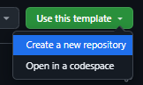
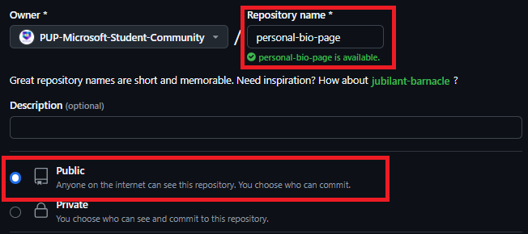
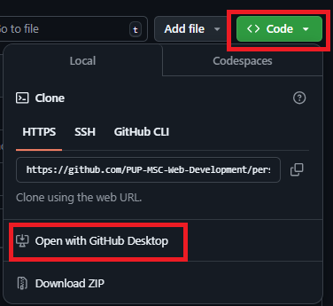
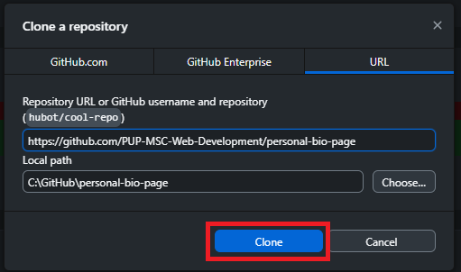
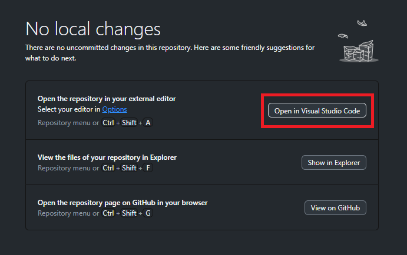

# 👨‍💼👩‍💼 Personal Resume Page 🏢

This project provides a template to build a simple resume webpage using HTML.
You’ll learn to organize your personal information, such as your name, contact details, work history, education, and skills, in a clean and semantic format.

## Learning Objectives
By working on this project, you will:

- 👩‍💻 Describe the basics of HTML

- 🔧 Use a coding tool

- 📝 Create a basic HTML page

- 📃 Make linked lists in HTML

- 💻 Use of semantic HTML tags.

## 📚 Microsoft Learn
This repository is inspired by the Microsoft Learn module entitled  [*"Build your first HTML webpage"*](https://learn.microsoft.com/training/modules/build-first-html-webpage/?wt.mc_id=studentamb_412650). It is highly recommended to complete the module for a deeper understanding of HTML concepts.
study session link
workshop link

## ⚙️ Setup Instructions
1. Create a New Repository Using This Template.
- Click the green "Use this template" button on this repository’s page.
  

__________
2. Name the repository "personal-resume-page"
- (Optional) You may set a description for your project if you want.
- Ensure the repository is set to public.

  

__________
3. Clone your repository
- Click the green "Code" button on this repository's page and then click "Open with Github Desktop" button.

__________
4. Finalize cloning by clicking the "Clone" button on Github Desktop.

__________
5. Start editing your project by clicking "Open in Visual Studio Code."

__________

6. Edit `index.html` to customize the HTML content. Be guided by Microsoft Learn:

[*"1"*](https://learn.microsoft.com/training/modules/build-first-html-webpage/4-exercise-create-html-page/?wt.mc_id=studentamb_412650)
[*"2"*](https://learn.microsoft.com/training/modules/build-first-html-webpage/7-exercise-lists-links/?wt.mc_id=studentamb_412650)

(note u dont have to do the codeswing part, just follow the "Add HTML to create the structure of your page" header )

8. Accomplish the [*Microsoft Learn knowledge check challenge.*](https://learn.microsoft.com/training/modules/build-first-html-webpage/8-knowledge-check/?wt.mc_id=studentamb_412650) and save the screenshot of your results.
9. (Optional) Deploy it to GitHub Pages, Azure Static Pages or your preferred hosting service.
10. Share the link to your website/repository via [Microsoft Form](https://forms.office.com/r/RhP1ia7bU6).

    
__________

# 🎉 Congratulations!
Feel free to explore and make this project your own! asdadasd fdgfdg. Dont hesitate to reach out to your team leads gfddfg

Happy Coding! 🚀

